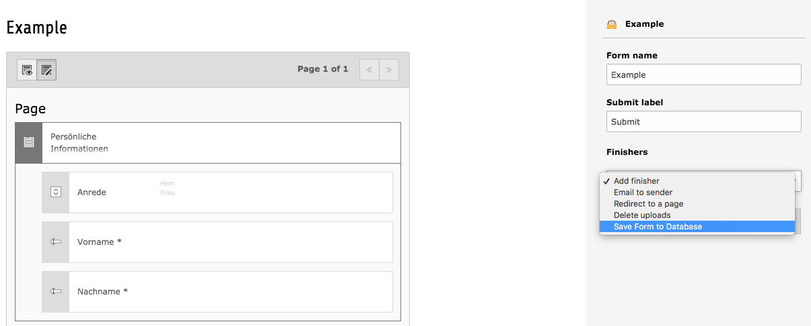
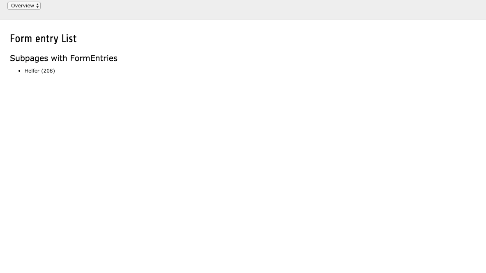
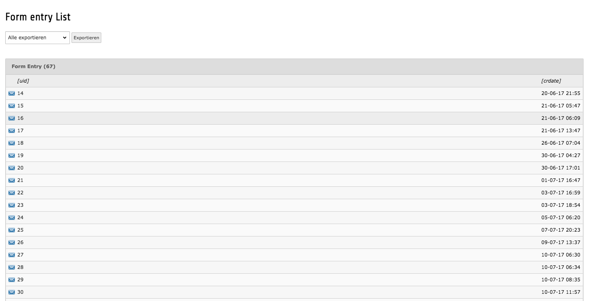
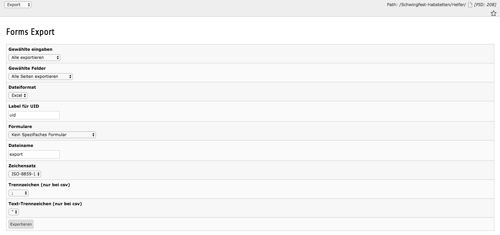

=============
Documentation
=============

Save submitted forms answers from the core extension forms made simple.

Saves submitted form answers in the database on the same pid where the form is inserted. Gives possibility to export the data as xsl, xml or csv.

How it works
------------

This extension adds a new finisher to the Module "Forms". By adding this finisher the extension saves all submitted forms into the pid where the form is displayed. A new module is added where all the submitts from a given pid are displayed - if there are subpages with saved forms, the pages are displayed.

There is a fast export on top of the list view where you can select either all or all new forms (not exported yet). An configurable export can be reached by changing the view to "Export".

Screenshots
-----------

-----------

-----------

-----------

-----------

Installation
------------

Through `TER <https://typo3.org/extensions/repository/view/frp_form_answers/>`_ or with `composer <https://composer.typo3.org/satis.html#!/frp_form_answers>`_ (typo3-ter/frp-form-answers).

Integration
-----------

Simply install the extension and add the finisher to a form.

* No TypoScript setup to include.

Contributing
------------

Bug reports
^^^^^^^^^^^

Bug reports are welcome through `GitLab <https://gitlab.com/frappant/typo3/extension/frp_form_answers>`_.

Please submit with your issue the debug log.

Pull request
^^^^^^^^^^^^

Pull request are welcome through `GitLab <https://gitlab.com/frappant/typo3/extension/frp_form_answers>`_.

Please note that pull requests to the *master* branch will be ignored. Please pull to the *develop* branch.

Changelog
---------

:1.0.0: First release